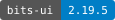
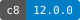
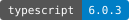
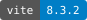

## Webpage: [operations.superduper.solutions](https://operations.superduper.solutions)

A browser-based platform for composing OpenAPI operations into reusable workflows.

> [!NOTE]
> This project is under active development and is currently in a pre-release state.

## npm commands

<code>npm ci</code>

- **Purpose:** Install locked dependencies.
- **Requirements:** Use the Node.js and npm versions declared in [`package.json`](package.json).

<code>npm run badges:coverage</code>

- **Purpose:** Update the source-coverage badge.
- **Requirements:** Requires Bash, jq and a fresh `npm run test:source:coverage` followed by
  `npm run test:coverage`.

<code>npm run badges:dependencies</code>

- **Purpose:** Update dependency-version badges.
- **Requirements:** Requires Bash, jq and current dependency versions in `package.json`.

<code>npm run badges:scenarios</code>

- **Purpose:** Update the test-scenario badge.
- **Requirements:** Requires Bash, jq and fresh, complete results from all four test suites.

<code>npm run build</code>

- **Purpose:** Build `dist/index.html`.
- **Requirements:** Run `npm ci` first.

<code>npm run dev</code>

- **Purpose:** Start the local development server.
- **Requirements:** Run `npm ci` first.

<code>npm run report:tests</code>

- **Purpose:** Generate the combined `tmp/test-report.html`.
- **Requirements:** Run `npm ci` first. Fresh, complete results from all four test suites are required.

<code>npm run test:acceptance</code>

- **Purpose:** Check the built output.
- **Requirements:** Run `npm ci` and `npm run build` first.

<code>npm run test:acceptance:coverage</code>

- **Purpose:** Run acceptance scenarios and collect coverage data.
- **Requirements:** Run `npm ci` and `npm run build` first.

<code>npm run test:automation</code>

- **Purpose:** Check repository automation without deploying.
- **Requirements:** Run `npm ci` first. Bash and jq are required.

<code>npm run test:browser</code>

- **Purpose:** Run browser scenarios in Chromium.
- **Requirements:** Run `npm ci` and `npm run build` first. Bash and running Docker are required.

<code>npm run test:coverage</code>

- **Purpose:** Generate reports in `tmp/test/coverage/` and enforce 100% statement, branch,
  function and line coverage.
- **Requirements:** Collect fresh coverage with `npm run test:source:coverage` or
  `npm run test:acceptance:coverage` first.

<code>npm run test:source</code>

- **Purpose:** Run source scenarios.
- **Requirements:** Run `npm ci` first.

<code>npm run test:source:coverage</code>

- **Purpose:** Run source scenarios and collect coverage data.
- **Requirements:** Run `npm ci` first.

<code>npm run typecheck</code>

- **Purpose:** Check Svelte components and TypeScript source.
- **Requirements:** Run `npm ci` first.

<code>npm test</code>

- **Purpose:** Run the acceptance suite only; alias for `npm run test:acceptance`.
- **Requirements:** Run `npm ci` and `npm run build` first.

## Development status

Creates releases from `develop` and validates and previews release and hotfix
pull requests before merging into `main`. Continues in the same release run to
tag and deploy, publish test and coverage reports, and synchronize released
changes back to `develop`.

---

Validates incoming changes before merging them into `develop`, checking branch
policy, types, tests, and build output. Keeps feature work, bug fixes, and
released changes integrated for the next release, then updates the
development preview.

## Quality Assurance

Test coverage of the application behavior, build output, and release automation,
showing which expected outcomes are verified and which scenarios fail, with
details to help investigate regressions.

---

Code coverage of the measured application source, showing which statements,
branches, functions, and lines are exercised by tests and where additional
tests are needed.

## Dependency packages

Supports the webpage’s user interface, providing the accessible dialog primitives
required by its `shadcn-svelte` sheet components.

---

Supports application testing by measuring source code coverage and generating
coverage reports. The release workflow uses its coverage checks to enforce
requirements and block releases that leave measured code untested.

---

Supports the webpage’s UI styling, combining default and custom `Tailwind CSS`
classes in `shadcn-svelte` components and resolving conflicts.

---

Supports application and CI validation by running source, acceptance, browser,
and automation scenarios defined in `Gherkin`, producing the results used by the
combined test report.

---

Retained for optional SVG icons in Svelte components. The main interface uses
locally bundled, filled Material Symbols Rounded, documented with their license
in [`src/assets/fonts`](src/assets/fonts/README.md).

---

Supports release quality review by generating the combined test report from
source, acceptance, browser, and automation results, with scenario outcomes and failure
details.

---

Checks the webpage in Chromium through Cucumber scenarios, using Playwright's
browser controls and assertions to verify user interactions and responsive
layout. Captures screenshots and traces to explain browser test failures.

---

Provides the webpage’s component framework and reactive state, supporting the
workflow editor, navigation, and shared UI components.

---

Checks the webpage’s `Svelte` components and `TypeScript` source for errors,
allowing the integration and release workflows to catch type and component
problems before building.

---

Connects the webpage’s `Svelte` components to the `Vite` build, compiling the
workflow editor, navigation, and controls into browser JavaScript and CSS.

---

Defines the webpage’s reusable component styles through its `shadcn-svelte`
button and sheet components, providing typed variants for button appearance,
size, and sheet placement.

---

Provides the webpage’s utility classes and shared theme tokens, used by its
`shadcn-svelte` components for layout, styling, colors, and corner radii.

---

Integrates the webpage’s `Tailwind CSS` styles with the `Vite` build, generating
the utilities and theme styles used by its buttons and navigation sheet.

---

Supports motion in the webpage’s `shadcn-svelte` navigation sheet, providing the
slide and fade animations used when the panel and its overlay open and close.

---

Provides the type system used by the webpage’s application code and `Svelte`
components, with `svelte-check` validating workflow data, connections, and
component properties before integration or release.

> [!NOTE]
> The upgrade to TypeScript 7 is pending compatibility support by the `svelte-check` package.
> The badge below tracks the upstream issue’s status and links to progress updates.
>
> 

---

Builds the webpage for deployment by combining application code, `Svelte`
components, and styles. Coordinates the `Svelte`, `Tailwind CSS`, and single-file
plugins used to produce the release build.

---

Packages the webpage for deployment as one HTML file with embedded JavaScript
and CSS, meeting the single-file requirement verified by the acceptance tests.

---

Provides the webpage’s workflow canvas, with draggable nodes, connection handles
and edges, and controls for navigating the diagram.
